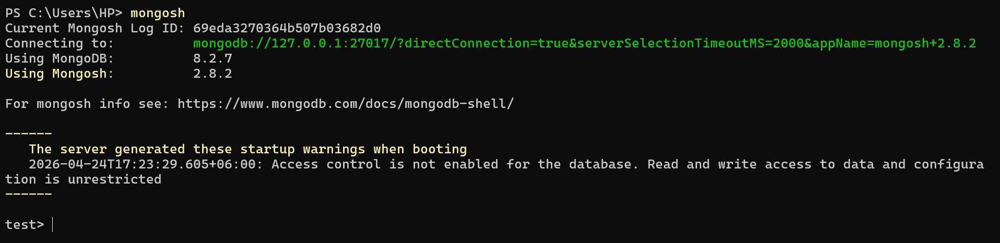

# Practical 3

## Introduction

This practical explains how the e-commerce database is designed using the MongoDB. Unlike traditional database, MongoDB stores data in flexible and JSON-like document.  This approach makes it easier to handle application where data changes over time, such as property listing and order system.

This practical demonstrates three concepts about MongoDB. First, it shows how to design MongoDB document structure and analyze the data using the aggregation pipeline. Lastly, it shows how to improve the performance by creating indexed and analyze how quires run using the explain() method.

## Schema design and Justification

Schema design is how we organize the data in MongoDB. 

### Collection Overview

In the e-commerce database, I have created total 4 collections. Collection is like a table in the relational database.  The four collections are:

- Users
    - This collection stores information about customers details with embedded address details.
- **Categories**
    - This collection stores the information about which product fall into which categories.
- **Products**
    - This stores the information about the product.
- **Orders**
    - This collection stores the information about the customers order with **embedded order items** and **referenced user/product data** for shared information.

**Embedding vs. Referencing**

In MongoDB, there is two ways to store related data. It is called Embedding and Referencing. Embedding means storing data inside the same document. This is useful when the data is always used together and does not grow in size. It also helps in fast data retrieval. It is used for one-to-one relationship.

Referencing means storing only the ID of the related data and linking it to another document. This is useful when the data can be used on its own and shared across multiple document. It is used for one-to-many or many-to-many relationship. It is helpful when the data can grow large over time.

### Schema Setup and Sample Data

#### Create a database and collections

First, I have connected to the local MongoDB using the mongosh command, this allows to access the database and run queries.



Then, I have created a database called **e-commerce**.  The command ‘uses e-commerce’ is used  switches to the e-commerce database; if the database does not exist, it creates the database automatically.

Then I have created 4 collections inside the e-commerce database.

4 collections created at:

- users
- product s
- categories
- orders


We can use the command ***‘show collections’*** to list or verify the collections that we have created earlier.


Or check in the MongoDB Compass.


#### Insert Sample Data

1. **Insert Users**
- **insertMany() is used to** insert multiple documents at once.

```bash
db.users.insertMany([
  {
    name: "Ranjung Yeshi Norbu",
    email: "Ranjung@gmail.com",
    phone: "+975-77847900",
    address: {
      line1: "Building 12",
      city: "Thimphu",
      country: "Bhutan",
      postalCode: "11001"
    },
    createdAt: new Date("2026-04-18T08:00:00Z")
  },
  {
    name: "Sonam Choden",
    email: "sonam@gmail.com",
    phone: "+975-17654321",
    address: {
      line1: "Flat 3B",
      city: "Phuntsholing",
      country: "Bhutan",
      postalCode: "21001"
    },
    createdAt: new Date("2026-04-19T10:30:00Z")
  }
])
```

**Result:**


- 2 users are inserted
    - Ranjung Yeshi Norbu
    - Sonam Choden

Here I have used the embedding in the address field. This is because the address and the user have one to one relationship and they are used together. This makes data retrieval faster and simpler.

1. **Insert Categories**

```bash
const electronicsId = new ObjectId()
const accessoriesId = new ObjectId()

db.categories.insertMany([
  { 
  _id: electronicsId,
  name: "Electronics",
  slug: "electronics",
  parentCategoryId: null },
  { 
  _id: accessoriesId, 
  
  name: "Accessories", slug: "accessories", 
  parentCategoryId: electronicsId }
])
```


1. **Insert Products**

```bash
const headphonesId = new ObjectId()
const cableId = new ObjectId()
const keyboardId = new ObjectId()

db.products.insertMany([
  {
    _id: headphonesId,
    name: "Wireless Bluetooth Headphones",
    slug: "wireless-bluetooth-headphones",
    categoryId: electronicsId,
    price: 129.99,
    currency: "USD",
    stock: 200,
    attributes: { brand: "Acme Audio", color: "black", wireless: true, batteryLifeHours: 24 },
    tags: ["audio", "wireless", "headphones"],
    createdAt: new Date("2026-04-18T10:00:00Z")
  },
  {
    _id: cableId,
    name: "USB-C Cable 1m",
    slug: "usb-c-cable-1m",
    categoryId: accessoriesId,
    price: 9.99,
    currency: "USD",
    stock: 500,
    attributes: { brand: "Acme Tech", lengthMeters: 1, color: "white" },
    tags: ["cable", "usb-c"],
    createdAt: new Date("2026-04-18T11:00:00Z")
  },
  {
    _id: keyboardId,
    name: "Mechanical Keyboard",
    slug: "mechanical-keyboard",
    categoryId: electronicsId,
    price: 79.99,
    currency: "USD",
    stock: 150,
    attributes: { brand: "Acme Input", layout: "US", switchType: "blue", backlight: true },
    tags: ["keyboard", "mechanical", "backlit"],
    createdAt: new Date("2026-04-19T09:00:00Z")
  }
])
```

**Result:**


In this design, I have used the category ID as the reference to the categories collection. 

And I have used embedding on the attributes field. This is because different products have different attributes. Example, **headphone** has brand, color, wireless and **cable** has brand, length Meters and color. This is why we use flexible attributes instead of fixed fields. The tag field is also used as embedded array of keyboard to help with searching. 

1. **Insert Orders**

```bash
const ranjung = db.users.findOne({ email: "Ranjung@gmail.com" })
const sonam = db.users.findOne({ email: "sonam@gmail.com" })

db.orders.insertMany([
  {
    userId: ranjung._id,
    status: "PAID",
    items: [
      { productId: headphonesId, productName: "Wireless Bluetooth Headphones", unitPrice: 129.99, quantity: 2, lineTotal: 259.98 },
      { productId: cableId, productName: "USB-C Cable 1m", unitPrice: 9.99, quantity: 1, lineTotal: 9.99 }
    ],
    grandTotal: 269.97,
    currency: "USD",
    createdAt: new Date("2026-04-19T15:30:00Z"),
    paymentMethod: "CARD"
  },
  {
    userId: sonam._id,
    status: "PAID",
    items: [
      { productId: keyboardId, productName: "Mechanical Keyboard", unitPrice: 79.99, quantity: 1, lineTotal: 79.99 }
    ],
    grandTotal: 79.99,
    currency: "USD",
    createdAt: new Date("2026-04-20T09:15:00Z"),
    paymentMethod: "COD"
  }
])

```

**Result:**


**Verify it in MongoDB compass**


**Logic**

- The userID is stored as a reference to the user collection.
- The items are embedded inside the order collection because the items always belongs to the order. The order always have an items. This avoids extra database queries.
- The ProductID is a reference to the product collection because multiple orders can use the same product.

### Aggregation Framework Queries

The Aggregation in MongoDB process the data in stages. The Aggregation framework works in step by step, where each step takes the result from the previous stage and then process it and finally passes it to the next one.  It is the process that gathers information from multiple document and then groups them together to perform calculations like findings sum or an average.

#### **Query 1 - Daily Sales:**

Here the goal is to calculate how much money was earned each day and how many order were placed. The total count of the order placed is only for the order that is marked as “PAID”. 

**Pipeline explained:**

- The orders collection is filtered only on the orders with status “PAID” and then the data is grouped by date. After that, the total amount is calculated for each day and finally the total result is given in sorted format.

**Query**

```bash
db.orders.aggregate([
  { $match: { status: "PAID" } },
  {
    $group: {
      _id: { year: { $year: "$createdAt" }, month: { $month: "$createdAt" }, day: { $dayOfMonth: "$createdAt" } },
      totalRevenue: { $sum: "$grandTotal" },
      orderCount: { $sum: 1 }
    }
  },
  {
    $project: {
      _id: 0,
      date: { $dateFromParts: { year: "$_id.year", month: "$_id.month", day: "$_id.day" } },
      totalRevenue: 1,
      orderCount: 1
    }
  },
  { $sort: { date: 1 } }
])
```

**Result:**


**Logic used:**

- **$match:** It is used to filter document matching the condition. Here I have used the condition on order with status “PAID”
- **$group:** It is used to group by date and aggregate.
- **$sort:** It is used to order result.
    - 1 = Ascending
    - -1 = Descending
- $sum: It finds the total sum

**Query 2 - Top 5 Products by Revenue**

**Pipeline explained.**

- It first filters only the paid orders and then the items inside each orders are separated and grouped them by product. Then it calculates the total revenue for each product and finally the result are sorted with the limit to the top % product.

```bash
db.orders.aggregate([
  { $match: { status: "PAID" } },
  { $unwind: "$items" },
  {
    $group: {
      _id: "$items.productId",
      productName: { $first: "$items.productName" },
      totalRevenue: { $sum: "$items.lineTotal" },
      totalQuantity: { $sum: "$items.quantity" }
    }
  },
  { $sort: { totalRevenue: -1 } },
  { $limit: 5 }
])
```

**Result:**


- **$limit:** Get the top 5
- $unwind: split an array field into separate documents
    - It takes the items array and  creates a new document for each item. Here there are 2 order with 1 to 2 items, so there are 3 total items using the $unwind function.

**Query 3 - Average Order Value per User**

The goal is to calculate how much each customer spends on average. It combines the data with the customer information that shows their names, making it easier to understand.

**Query**

```bash
db.orders.aggregate([
  { $match: { status: "PAID" } },
  {
    $group: {
      _id: "$userId",
      totalOrders: { $sum: 1 },
      totalSpent: { $sum: "$grandTotal" },
      minOrderValue: { $min: "$grandTotal" },
      maxOrderValue: { $max: "$grandTotal" },
      avgOrderValue: { $avg: "$grandTotal" }
    }
  },
  { $lookup: { from: "users", localField: "_id", foreignField: "_id", as: "user" } },
  { $unwind: "$user" },
  {
    $project: {
      _id: 0,
      userName: "$user.name",
      totalOrders: 1,
      totalSpent: 1,
      avgOrderValue: 1
    }
  },
  { $sort: { totalSpent: -1 } }
])
```

**Result:**


- **$lookup:** is used to combine two different collections together.

**Query 4 - Products with Category Name**

The goal is to create a product catalog so that it shows each product along with its category name. It combines the product data with category information so that the final result is easier to understand.

**Query Used:**

```bash
db.products.aggregate([
  { $lookup: { from: "categories", localField: "categoryId", foreignField: "_id", as: "category" } },
  { $unwind: "$category" },
  {
    $project: {
      _id: 0,
      name: 1,
      price: 1,
      "attributes.brand": 1,
      categoryName: "$category.name"
    }
  },
  { $sort: { categoryName: 1, name: 1 } }
])
```

**Result:**


- Got three product along with the category information.

This query uses the dot notation in $project to show that only the specific filed inside a nested document is displayed, instead of displaying everything. The results are sorted by category name and product name making the catalog organized and easy to read.

### Index and Query Optimization

Index are the data structure that speeds up the queries. 

#### Indexes Created

I have create 4 differnt indexes.

| **Index Name** | **Use Case** |
| --- | --- |
| **idx_orders_user_createdAt** | It fetches a user’s recent order sorted by date.  |
| **idx_orders_status_createdAt** | It filters only paid orders within a specific date range and is used to calculate daily sales. |
| **idx_products_category_price** | It shows products from a specific category and sorts them by price so they are easy to browse. |
| **idx_products_text** | It search for products using text and shows result based on relevant scores. |

**Index 1  User Orders by Date**

**Usage:**

- Find the recent order of a specific user

**Query:**

```bash
db.orders.createIndex(
  { userId: 1, createdAt: -1 },
  { name: "idx_orders_user_createdAt" }
)
```

**Result:**


- Index created “idx_orders_user_createdAt”

**ESR breakdown:**

- Equality used is userId
- sort is createdAt

**Index 2 Orders by Status, Date, Amount (ESR)**

**Usage:**

- Find the daily revenue report and sales dashboard

**Query**

```bash
db.orders.createIndex(
  { status: 1, createdAt: -1, grandTotal: 1 },
  { name: "idx_orders_status_createdAt_grandTotal" }
)
```

**Result:**


**ESR Rule:** Put **E**quality fields first (`status`), then **S**ort fields (`createdAt`), then **R**ange fields (`grandTotal`). This order maximises index usage.

**Index 3 Products by Category and Price**

**Usage:**
- Used to browse products in a category and sort them by price.

**Query:**

```bash
db.products.createIndex(
  { categoryId: 1, price: 1 },
  { name: "idx_products_category_price" }
)
```

**Result:**


**Index 4 Full-Text Search Index**

**Usage:**

- Used as a search bar to find products easily.

**Query**

```bash
db.products.createIndex(
  { name: "text", tags: "text" },
  { name: "idx_products_text", weights: { name: 10, tags: 5 } }
)
```

**Result**


**Testing the text search:**

```bash
db.products.find(
  { $text: { $search: "wireless keyboard" } },
  { score: { $meta: "textScore" }, name: 1, price: 1 }
).sort({ score: { $meta: "textScore" } })
```


**Verify All Indexes**

```bash
ecommerce> db.orders.getIndexes()
ecommerce> db.products.getIndexes()
ecommerce> db.users.getIndexes()
```


### **PERFORMANCE ANALYSIS**

Let’s compare the query performance of BEFORE creating the index and AFTER creating the index. 

This will be done by the **explain()** function. The explain() function shows how MongoDB executes the query and returns the details about the execution.

**BEFORE creating an index** 

This is running the explain() function before creating an index.

**Query:**

The query is used to find all the orders that have status ”PAID” and was created on or after April 19,  2026. Then after filtering, it sorts the result in descending order. The explain() function is used to show how MongoDB runs the query and how efficient it is.

```bash
db.orders.find(
  { status: "PAID", createdAt: { $gte: new Date("2026-04-19") } }
).sort({ createdAt: -1 }).explain("executionStats")
```

Results:


Findings:

- I have found out that the MongoDB uses the **COLLSCAN**(**Collection Scan**). This means that it scans every document to find the matching data. This approach is not efficient because it scans through every document in the collection, if the dataset is large then it would take more time which is inefficient.
- The **totalDocsExamined** is only 2 in my case. That means that only 2 document is scanned or checked. I have only created 2 document in the order collection but if there are more document then COLLSCAN will be slow because it have to check every document inside the collection.

**AFTER the index exists**

This is running the explain() function after creating an index.

**Query:**

The query is used to find all the orders that have status ”PAID” and was created on or after April 19,  2026. Then after filtering, it sorts the result in descending order. The explain() function is used to show how MongoDB runs the query and how efficient it is.

```bash
db.orders.find(
  { status: "PAID", createdAt: { $gte: new Date("2026-04-19") } }
).sort({ createdAt: -1 }).explain("executionStats")
```


Findings:

- Here the MongoDB uses the IXSCAN(Index scan).

After comparing the results I understood that moving from a COLLSCAN to an IXSCAN shows the efficiency of the data retrieval. It shows that the indexes doesn't change the correctness of the result but it shows the efficiency of data retrieval, improving the overall performance of the database. Example, in real system there will be millions of data, so by using indexes is important because it improves the overall performance as it keeps the application fast and prevent delay or timeout.

### Lesson learned

By doing this practical, I have learned that database should be designed based on how the data is read, not just on how it is organized. In this practical I have  embedded the order item inside the order collection so that the full order can be retrieved in one query. I have also learned that the best choice between the embedding and referencing depends on how the data is used and how big the data can grow. Embedding makes data faster to read but not efficient if the data keeps growing. Referencing keeps the data separate, we need to join the data. Both have pros and cons.

I also learned that the we can use indexing to improve the overall performance of the application. Indexing should be planned based on how the queries are written. We should know that creating indexes without understanding the query pattern does not improve performance. The new concept I learned is using the explain() function. This function helps to see how the queries run. It shows whether it scans all the documents (COLLSCAN) or uses an index (IXSCAN) and helps how efficient the query is.

### Conclusion and Refection

This practical shows how the MongoDB is used as a real database for an e-commerce application. It focuses on three important thing, designing the data structure, analyzing data using the aggregation and improving the performance by creating indexes. It showed that the MongoDB is powerful not because it is flexible but because of we use that flexibility. Deciding when to use embedding and referencing and using flexible fields for different product directly affect the  how accurate the data is and how fast the system works.

The aggregation shows that MongoDB can be used for data analysis. It is not just used for storing data. We can use different aggregation pipeline stages like filtering, grouping and sorting and others, that can help to process the data.

One of the most important thing I learned was using explain() function, it is to check query performance. It shows the difference between COLLSCAN scanning all the data and IXSCAN using indexes, and how efficient a query is. 

Overall, the practical helped me to connect the theory concept to implement it in the real-world application. The e-commerce example is good in MongoDB because it includes different challenges like handling flexible data, processing queries and analyzing data.